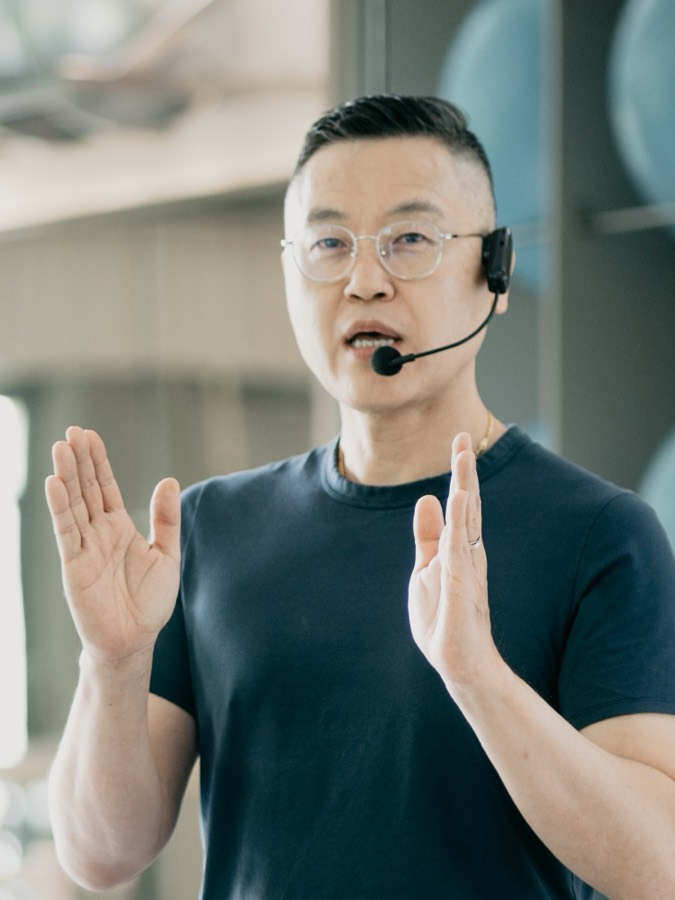
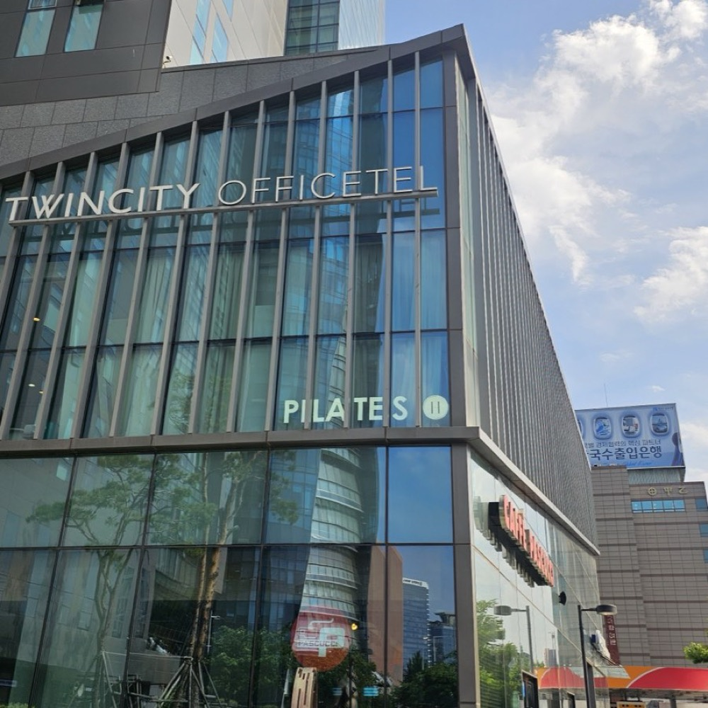

# BODYNOX ACADEMY

바디녹스 아카데미 필라테스 지도자 양성 과정(BPM 커리큘럼) 소개 정적 사이트.
빌드 도구 없이 `index.html`을 브라우저에서 바로 열면 동작합니다.

## 폴더 구조

```
bodynox-academy/
├─ index.html              # 메인 페이지 (모든 섹션)
├─ apply.html              # 교육 신청 (신청서 → 결제 → 확정 안내)
├─ privacy.html            # 개인정보처리방침
├─ center-*.html           # 교육센터 상세 6개 (seoul/gwanghwamun/seocho/gangbuk/jakarta/bangkok)
├─ recruit-49.html         # 49기 주말반 모집 세부 안내 페이지
├─ online.html             # Online 과정 상세 페이지
├─ foundation.html         # Foundation 과정 상세 페이지
├─ intermediate.html       # Intermediate 과정 상세 페이지
├─ assets/
│  ├─ css/style.css        # 디자인 토큰 + 전체 스타일
│  ├─ js/main.js           # 모바일 메뉴, 스크롤 등장, 내비 하이라이트
│  └─ img/                 # 로고 에셋 + 스튜디오 · 강사 사진
├─ .nojekyll               # GitHub Pages에서 Jekyll 처리 비활성화
└─ README.md
```

## 브랜드 컬러 · 로고

톤앤매너는 BPM 로고(`BPM logo 1.jpg`)에서 추출한 딥 라즈베리를 기준으로 맞췄습니다.
색상은 전부 `assets/css/style.css` 상단의 CSS 변수로 관리되므로, 변수만 바꾸면 사이트 전체가 따라갑니다.

| 변수 | 값 | 용도 |
|---|---|---|
| `--c-accent` | `#BE0A4C` | BPM 브랜드 컬러 — CTA 버튼, 아이브로우, 태그, 불릿 |
| `--c-accent-dk` | `#98093D` | 버튼 호버, 링크 강조 |
| `--c-accent-lt` | `#E37FA0` | 어두운 배경 위 포인트 |
| `--c-accent-bg` | `#FAE6EC` | 옅은 브랜드 틴트 (뱃지 배경) |
| `--c-dark` | `#2A171E` | 와인 블랙 — 진로 섹션 배경 |
| `--c-bg` / `--c-bg-tint` | `#FBF9F7` / `#F4EEE9` | 웜 아이보리 / 베이지 섹션 |

카카오톡 상담 버튼은 `https://pf.kakao.com/_xexjbUT/chat` 로 연결되어 있습니다.

로고 에셋은 원본 JPG의 흰 배경을 제거해 투명 PNG로 만들어 두었습니다.

| 파일 | 내용 | 사용 위치 |
|---|---|---|
| `bpm-logo.png` | 원형 마크 + 워드마크 전체 락업 | 히어로 뱃지, 푸터 |
| `bpm-mark.png` | 원형 BPM 마크만 | 헤더 |
| `bpm-logo-white.png` | 전체 락업 흰색 버전 | 어두운 배경용 (예비) |
| `bpm-mark-white.png` | 마크 흰색 버전 | 진로 섹션 카드 |
| `favicon.png` / `apple-touch-icon.png` | 파비콘 · iOS 홈화면 아이콘 | `<head>` |

원본 AI 파일로 더 선명한 로고를 쓰려면, 배경 투명 PNG(폭 600px 이상)로 내보내 같은 이름으로 덮어쓰면 됩니다.

## 로컬에서 열기

**방법 1 — 바로 열기 (가장 간단)**

```bash
open index.html
```

Finder에서 `index.html`을 더블클릭해도 됩니다.

**방법 2 — 로컬 서버로 열기 (권장, 실제 배포 환경과 동일)**

```bash
python3 -m http.server 8000
```

그다음 브라우저에서 <http://localhost:8000> 접속. (종료: `Ctrl + C`)

## 교체해야 할 임시 항목

| 위치 | 내용 |
|---|---|
| `privacy.html` | 공개 전 법률 검토 권장 (수집 항목 · 목적 · 보유 기간은 참가신청서 기준으로 작성) |
| 사진 교체 시 | 파일을 덮어쓴 뒤 HTML의 `?v=32` 숫자를 함께 올려야 브라우저가 새 사진을 받아옵니다 |
| `assets/css/style.css` | 구글폼 임베드 높이 — `.form-embed iframe { height }` (모바일 2500px / 데스크톱 2100px). 폼 아래 빈 공간이 남으면 줄이고, 폼 안에 스크롤바가 생기면 늘리세요 |
| `index.html` 문의 정보 | 주소 · 전화번호 · 이메일 · 인스타그램 |
| `index.html` 과정/일정/강사진 | 임시 텍스트를 실제 커리큘럼 · 기수 일정 · 약력으로 교체 |
| `.media-placeholder` 블록 | `assets/img/`에 사진을 넣고 ``로 교체 |

사진 교체 예시:

```html
<!-- 기존 -->
<div class="media-placeholder media-placeholder--portrait">
  <span class="media-placeholder__label">강사 사진</span>
</div>

<!-- 교체 후 -->

```

## 사진

| 파일 | 사용 위치 |
|---|---|
| `hero-teaching.jpg` | 히어로 (데스크톱 5:4 / 모바일 4:3 크롭) |
| `scene-classroom.jpg` | 교육 현장 갤러리 — 왼쪽 큰 사진 |
| `scene-lecture.jpg` / `scene-handson.jpg` | 교육 현장 갤러리 — 오른쪽 2장 |

모두 가로형(3:2) 원본을 웹용으로 리사이즈·압축한 것이고, `object-fit: cover`로 크롭됩니다.
같은 파일명으로 덮어쓰면 레이아웃 수정 없이 교체됩니다.
강사진 사진 자리는 아직 플레이스홀더입니다.

## 사진 자리 (photo-slot) 교체 방법

아직 사진이 없는 자리는 `.photo-slot` 블록으로 만들어 두었습니다.
회색 박스 안에 **넣어야 할 파일명**이 적혀 있으니, 그 이름으로 `assets/img/`에 저장하고
블록을 `` 한 줄로 바꾸면 됩니다.

```html
<!-- 기존 -->
<div class="photo-slot photo-slot--square">
  <span class="photo-slot__label">센터 사진</span>
  <span class="photo-slot__hint">assets/img/center-seoul.jpg</span>
</div>

<!-- 교체 후 -->

```

`photo-slot` 종류와 **제작 크기** (캔바 등에서 이 크기로 만드세요):

| 클래스 | 비율 | 제작 크기 | 쓰이는 곳 | 파일명 |
|---|---|---|---|---|
| `photo-slot--wide` | 16:10 | **1200 × 750** | 모집 기수 카드 | `intake-49.jpg` ~ `intake-53.jpg` |
| `photo-slot--square` | 1:1 | **1000 × 1000** | 교육센터, 갤러리 하단 | `center-*.jpg`, `scene-06~09.jpg` |
| `photo-slot--portrait` | 3:4 | **900 × 1200** | 강사 프로필 | `instructor-2.jpg`, `instructor-3.jpg` |
| (기본) | 3:2 | **1500 × 1000** | 갤러리 큰 사진 | `scene-05.jpg` |

- 형식 JPG, 용량 200~300KB 내외 (캔바 내보내기: JPG · 품질 80% 권장)
- 비율이 조금 달라도 `object-fit: cover`로 잘려서 채워집니다. 다만 인물·문자가 가장자리에
  붙어 있으면 잘릴 수 있으니 **중앙에서 8% 정도 여백**을 두고 배치해 주세요.
- 카드 상단에 들어가는 사진(`--wide`, `--portrait`)은 위쪽 두 모서리가 둥글게 처리됩니다.

## 교육센터 상세 페이지

6개 센터 페이지는 `tools/build-centers.py` 로 한 번에 생성합니다.
마스터 강사·주소·연락처를 바꿀 때는 `tools/centers_data.py` 를 수정하고 스크립트를 다시 실행하세요.

```bash
python3 tools/build-centers.py
```

각 페이지의 사진 자리:

| 자리 | 파일명 | 크기 |
|---|---|---|
| 목록 카드 썸네일 | `center-<slug>.jpg` | 1000 × 1000 |
| 마스터 강사 사진 | `master-<slug>-<n>.jpg` | 900 × 1200 |
| 스튜디오 사진 (최대 10장) | `studio-<slug>-01.jpg` ~ `-10.jpg` | 1600 × 1000 |

마스터 강사 소개글은 **500자 이내**로 작성합니다 (HTML 주석에 표시해 두었습니다).

## 캐시 주의

`index.html`에서 CSS·JS를 `style.css?v=2`, `main.js?v=2` 형태로 불러옵니다.
브라우저가 예전 파일을 계속 쓰는 것을 막기 위한 버전 표시이므로,
**CSS나 JS를 수정해 배포할 때는 이 숫자를 함께 올려주세요** (v=2 → v=3).
숫자를 올리지 않으면 재방문자에게 최대 10분간 이전 디자인이 보일 수 있습니다.

## GitHub Pages 배포

```bash
git init
git add .
git commit -m "Add Bodynox Academy site"
git branch -M main
git remote add origin https://github.com/<계정>/bodynox-academy.git
git push -u origin main
```

GitHub 저장소 → **Settings → Pages → Build and deployment**
→ Source: `Deploy from a branch`, Branch: `main` / `/ (root)` → Save.

1~2분 뒤 `https://<계정>.github.io/bodynox-academy/` 에서 확인할 수 있습니다.
모든 경로를 상대경로(`./assets/...`)로 작성했기 때문에 하위 경로 배포에서도 그대로 동작합니다.

## 커스텀 도메인 (bpm.bodynox.com)

저장소에 `CNAME` 파일이 있어 GitHub Pages가 `bpm.bodynox.com`으로 서비스합니다.

DNS 설정 (Cloudflare):

| Type | Name | Target | Proxy |
|---|---|---|---|
| CNAME | `bpm` | `roiim0224.github.io` | **DNS only (회색 구름)** |

프록시(주황색 구름)를 켜면 GitHub이 SSL 인증서를 발급하지 못합니다. 반드시 회색으로 두세요.

GitHub 저장소 → Settings → Pages → Custom domain 에 `bpm.bodynox.com` 입력 후
DNS 확인이 끝나면 `Enforce HTTPS` 를 체크합니다.

도메인을 바꾸면 아래 파일의 주소도 함께 수정해야 합니다.
- `CNAME`
- 각 HTML 의 `<link rel="canonical">`, `<meta property="og:url">`
- `robots.txt`, `sitemap.xml`
